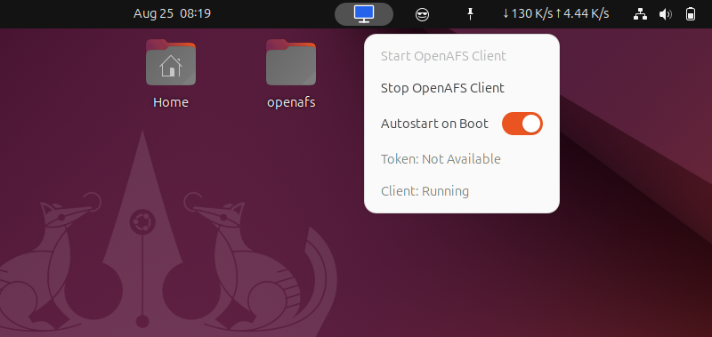

# OpenAFS Client Manager — GNOME Shell Extension

> **GSoC 2025 Project** under the [OpenAFS](https://www.openafs.org/) organization

## 📌 Overview

This GNOME Shell extension aims to provide a **graphical interface** for managing the **OpenAFS** client on Linux desktops. OpenAFS is a powerful distributed file system widely adopted in academic and research settings, but its reliance on CLI tools can make it less approachable for everyday users.

This extension simplifies and enhances user interaction with OpenAFS by integrating a GUI directly into the GNOME Shell top bar.

---

## ✨ Features

- ✅ Start and stop the OpenAFS client via systemd
- ✅ Toggle autostart for the OpenAFS client (enable/disable on boot)
- ✅ View token expiration and current AFS cell name (or “cell connectivity”)
- ✅ Real-time status updates for client and token information
- ✅ User notifications for successful or failed operations
- ✅ Dynamic UI feedback during client and autostart actions

---

## 🔧 Technical Stack

- **GJS (GNOME JavaScript)** for writing the extension logic
- **GNOME Shell APIs** for UI and system integration
- **GLib.spawn_command_line_async** for commands like:
  - `systemctl start/stop openafs-client`
  - `systemctl enable/disable openafs-client`
  - `aklog` for token handling
- **GLib.spawn_async_with_pipes** for securely handling password prompts via `kinit`
- **St.Button**, **St.Label**, **PopupSwitchMenuItem** for native GNOME-style UI elements
- **Promises and async operations** to keep UI non-blocking

---

## 📁 Project Structure

```text
gnome-shell-extension-openafs/
├── assets/
│   └── screenshot.png        # UI preview image
├── icons/
│   ├── client-on.svg         # Icon for active client status
│   └── client-off.svg        # Icon for inactive client status
├── extension.js              # Core logic of the extension, handles enable/disable
├── indicator.js              # Indicator class for panel menu and UI logic
├── utils.js                  # Utility functions for checking client and token status
├── eslint.config.js          # ESLint configuration based on GJS style guide
├── package.json              # npm package for development tools (e.g., ESLint)
├── metadata.json             # Extension metadata
├── stylesheet.css            # Optional styles
└── README.md                 # Project documentation
```

---

## 🚀 Installation & Testing Instructions

Follow these steps to install and test the extension locally:

### 1️⃣ Clone the Repository

```bash
git clone https://github.com/ts-31/gnome-shell-extension-openafs.git
cd gnome-shell-extension-openafs
```

### 2️⃣ Create Extension Directory

GNOME extensions should be placed in a specific folder:

```bash
mkdir -p ~/.local/share/gnome-shell/extensions/openafs-client@openafs.org
cp -v -r * ~/.local/share/gnome-shell/extensions/openafs-client@openafs.org/
```

### 3️⃣ Restart GNOME Shell

- **X11 session**: Press `Alt + F2`, type `r`, and press Enter. (Recommended)
- **Wayland session**: Log out and log back in.

### 4️⃣ Enable the Extension

Use GNOME Extensions App (GUI) or terminal:

```bash
gnome-extensions enable "openafs-client@openafs.org"
```

### 5️⃣ Test the Extension

Click the **top bar icon** labeled “OpenAFS Status”.

Then from the terminal, toggle the client status:

```bash
sudo systemctl start openafs-client
# → Extension should show "Client: Running (cell: example.com)" if a cell is configured
# → If no cell is available, it will show "Client: Running (cell: not available)"

sudo systemctl start openafs-client
# → Click extension icon → Should show "Client: Running"

# Test autostart toggle
sudo systemctl disable openafs-client
# → Click extension icon → Toggle "Autostart on Boot" should be off
sudo systemctl enable openafs-client
# → Click extension icon → Toggle "Autostart on Boot" should be on
```

---

## 🧑‍💻 Development

This project uses ESLint with the GJS-recommended configuration for code quality.

### 1️⃣ Install dependencies:
```bash
  npm install
```
### 2️⃣ Run the linter:
```bash
  npm run lint
```

---

## 🧑‍💻 GSoC 2025 Info

- **Project**: GNOME Shell Extension for OpenAFS
- **Mentors**: Mike Meffie, Gaurav Saxena
- **Student**: [Tejas Sonawane](https://github.com/ts-31)
- **Organization**: [OpenAFS](http://github.com/openafs-contrib/)
- **Program**: [Google Summer of Code 2025](https://summerofcode.withgoogle.com/)

---

## 🤝 Contributing

This extension is in active development as part of GSoC 2025. Contributions, suggestions, and feedback are welcome via [issues](https://github.com/openafs-contrib/gnome-shell-extension-openafs/issues) and pull requests.

---

### 🙌 Special Thanks

To the OpenAFS team and GNOME community for building incredible open infrastructure for decades.

---

> _"Bridging CLI power with GUI ease for OpenAFS users."_ — GSoC 2025 Student Developer

## 📸 Screenshots

### 🖼️ GNOME Top Bar Menu Preview


Shows the OpenAFS status menu with Start/Stop client options, a toggle switch for enabling/disabling autostart on boot, token status, and client status.